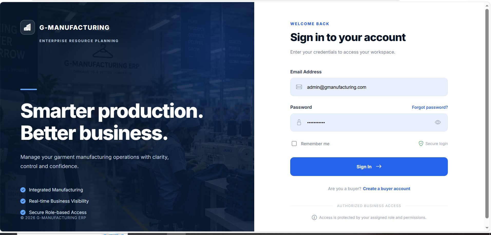
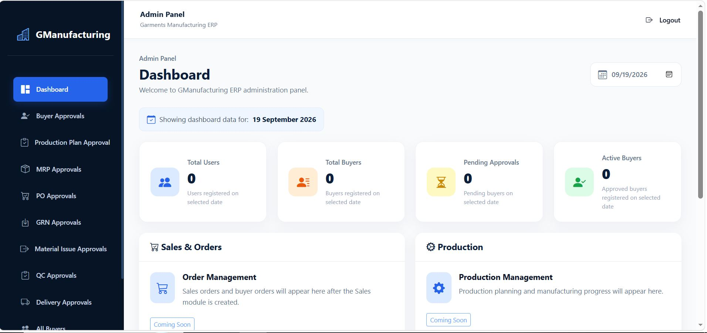
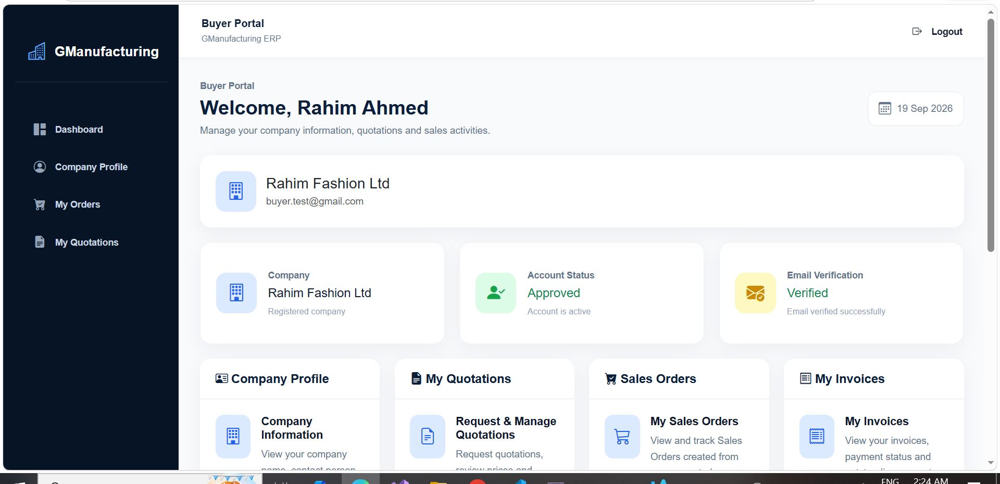
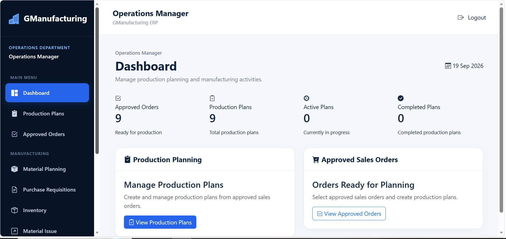
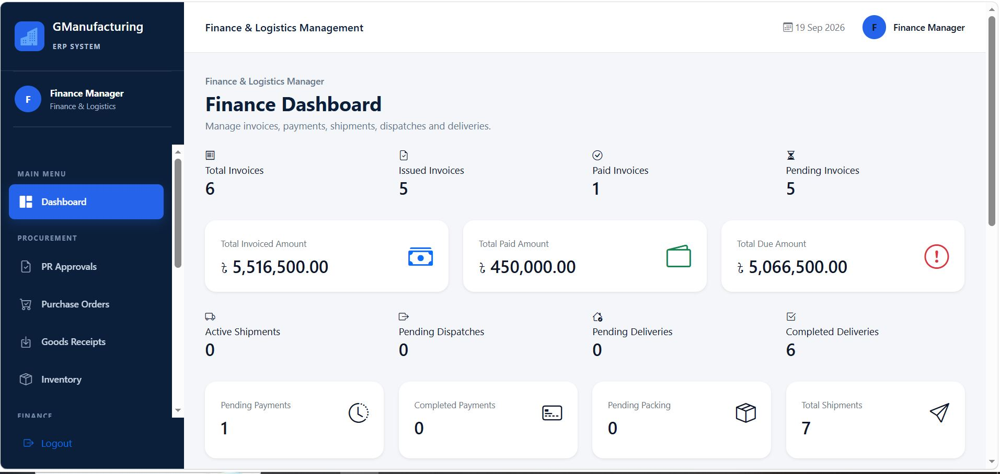
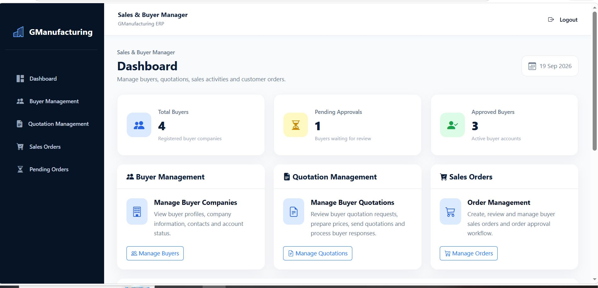

# Garments Manufacturing ERP System

A web-based Enterprise Resource Planning (ERP) application for coordinating garment manufacturing operations, including buyer and sales activities, production, procurement, inventory, quality control, finished goods, packing, logistics, invoicing, and payments.

## Project Overview

The system brings interconnected garment-manufacturing workflows into one application. It uses role-based authorization to separate staff responsibilities from the Buyer customer portal.

## User Roles & Responsibilities

The application has four staff roles and a separate customer-facing Buyer role.

| Role | Main responsibilities |
|---|---|
| **Admin** | User management; buyer approval; designated production plan, MRP, material issue, goods receipt, purchase order, quality-control, and delivery approvals. |
| **SalesBuyerManager** | Buyer management, quotations, sales orders, and sales dashboard activities. |
| **Buyer** | Customer portal; quotations, orders, invoices, available payment actions, profile, and notifications. |
| **OperationsManager** | Production plans, MRP, purchase requisitions, material issues, production monitoring, quality control, finished goods, and inventory operations. |
| **FinanceLogisticsManager** | Invoice and payment management; purchase-order and goods-receipt activities; inventory-related work; packing, shipment, dispatch, delivery, and purchase-requisition approval activities. |

> Role summaries describe the controller-level structure. Exact permissions and approval transitions depend on the implemented authorization rules and individual actions.

## Main Modules

- Authentication and role-based authorization
- Buyer management and customer portal
- Quotations and sales orders
- Production planning and Material Requirement Planning (MRP)
- Purchase requisitions, purchase orders, and goods receipts
- Inventory and material issue
- Production monitoring and quality inspection
- Finished goods, transactions, and rework
- Packing, shipments, dispatch, and delivery
- Invoices and payment tracking

## Technology Stack

- **Framework:** ASP.NET Core MVC
- **Language:** C#
- **Target framework:** .NET 8
- **ORM:** Entity Framework Core
- **Database:** Microsoft SQL Server
- **Authentication:** ASP.NET Core Identity
- **Views/UI:** Razor Views, HTML, CSS, JavaScript
- **IDE:** Microsoft Visual Studio

## Architecture

```text
Users (Admin / SalesBuyerManager / Buyer /
       OperationsManager / FinanceLogisticsManager)
                         |
                         v
              ASP.NET Core MVC
        Controllers | Models | Razor Views
        Authentication | Authorization
                         |
                         v
                Entity Framework Core
                         |
                         v
                Microsoft SQL Server
```

## High-Level Business Workflow

```text
Buyer & Quotation
       |
       v
Sales Order
       |
       v
Production Planning & MRP
       |
       v
Procurement / Goods Receipt / Inventory
       |
       v
Material Issue & Production Monitoring
       |
       v
Quality Inspection & Finished Goods
       |
       v
Packing → Shipment → Dispatch / Delivery
       |
       v
Invoice & Payment
```

This is a high-level overview; actual process order and approval requirements may vary by transaction and status.
## 🚀 Live Demo

🔗 **Live Website:** [GManufacturing ERP](http://gmanufacturingerp.runasp.net/)

## 💻 Technologies Used

- ASP.NET Core MVC (.NET 8)
- C#
- Entity Framework Core
- Microsoft SQL Server
- Bootstrap
- HTML, CSS, JavaScript

## 📌 Project Overview

GManufacturing ERP is a web-based Garments Manufacturing
ERP System designed to manage sales, production, inventory,
finance, and logistics operations.
## Screenshots

### Login Page


### Admin Dashboard


### Buyer Portal


### Operations Manager Dashboard


### Finance & Logistics Dashboard


### Sales & Buyer Manager Dashboard


## Getting Started

### Prerequisites

- Visual Studio with the .NET 8 development workload
- .NET 8 SDK
- Microsoft SQL Server
- SQL Server Management Studio (optional, for database administration)
- Git

### 1. Clone the repository

```bash
git clone https://github.com/siamhossain-Iubat/Garments-Manufacturing-ERP-System-.git
cd Garments-Manufacturing-ERP-System-
```

### 2. Open the solution

Open the `.sln` file in Visual Studio, restore NuGet packages, and set the web application project as the startup project.

### 3. Configure the database and secrets

Configure your own SQL Server connection string using .NET user secrets or environment-specific configuration. Do not commit database passwords, payment-provider credentials, API keys, or other secrets.

If the project uses Entity Framework Core migrations, apply the migrations included in the repository. Otherwise, restore or create the database using the project's supplied database setup instructions/scripts.

### 4. Run the application

Run the project using Visual Studio's **Start** button, or from the web project directory:

```bash
dotnet restore
dotnet build
dotnet run
```

Open the local URL shown by Visual Studio or the terminal.

## Security Notes

- Keep production credentials and payment-provider secrets out of source control.
- Use local user secrets or secure environment configuration for sensitive settings.
- Review authorization on sensitive business actions before deployment.
- Use sandbox payment credentials only for testing.

## Project Information

| Item | Details |
|---|---|
| Project | Garments Manufacturing ERP System |
| Developer | Siam Hossain |
| Framework | ASP.NET Core MVC / .NET 8 |
| Database | Microsoft SQL Server |
| Repository | [GitHub Repository](https://github.com/siamhossain-Iubat/Garments-Manufacturing-ERP-System-) |

## License

No open-source license is specified in this repository.

---
Developed by **Siam Hossain**.
